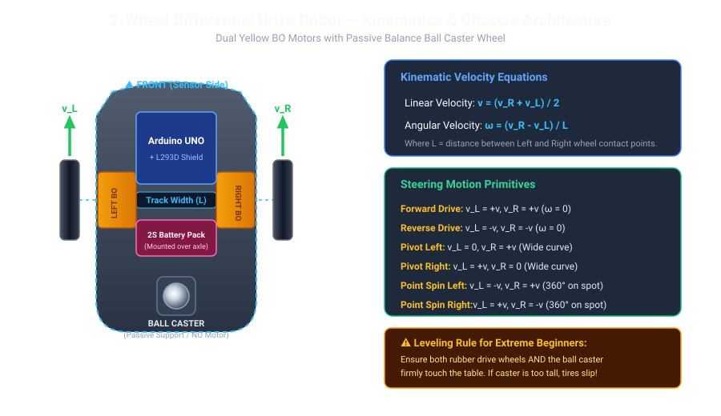
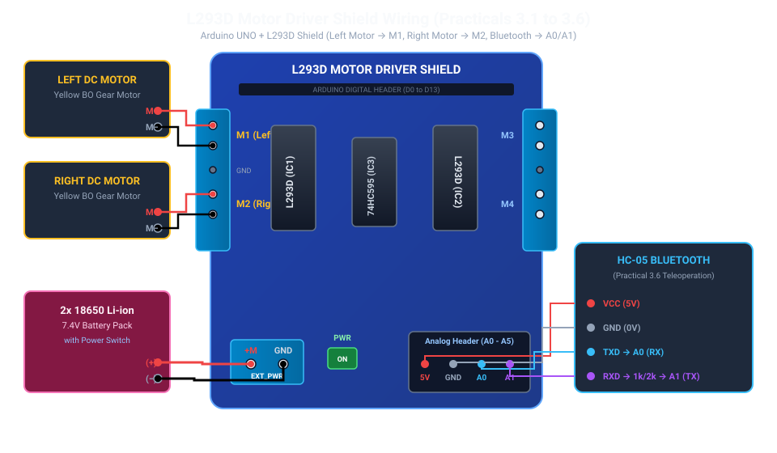
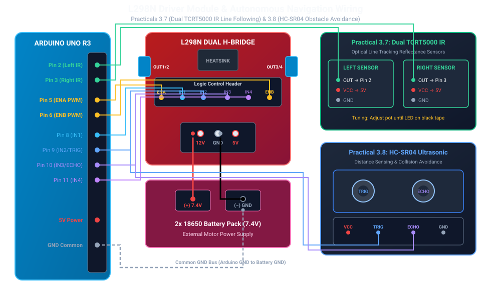

# NIELIT Robotics Practicals — Pinout & Wiring Reference Guide

A complete beginner-friendly hardware and wiring reference for the **NIELIT Robotics Practicals** series (3.1 to 3.8).

---

## 1. Hardware Driver Allocation Across Practicals

| Practical | Title | Motor Driver Used |
| :--- | :--- | :--- |
| **3.1 to 3.6** | Assembly, H-Bridge, DC Motors, Kinematics, PWM, Bluetooth | **L293D Motor Driver Shield** (Plugged directly on top of Arduino UNO) |
| **3.7 & 3.8** | Line Following & Obstacle Avoidance | **L298N Motor Driver Module** (Connected via jumper wires to Arduino pins) |

---

## 2. 2-Wheel Differential Drive Robot Architecture



---

## 3. Configuration for Practicals 3.1 – 3.6 (L293D Motor Shield)

Plug the blue **L293D Motor Driver Shield** directly on top of your Arduino UNO.



### Motor & Bluetooth Connections (3.1 to 3.6):
* **Left Motor:** Connected to blue screw terminal **M1** (Top-Left)
* **Right Motor:** Connected to blue screw terminal **M2** (Bottom-Left)
* **Battery Power (6V - 7.4V):** Connected to **EXT_PWR (+M and GND)** with **PWR Jumper ON**
* **Bluetooth (Practical 3.6):**
  * `HC-05 TXD` $\rightarrow$ **Analog Pin A0** (SoftwareSerial RX)
  * `HC-05 RXD` $\rightarrow$ **Analog Pin A1** (SoftwareSerial TX, via 1k/2k resistor divider to protect 3.3V logic)
  * `HC-05 VCC/GND` $\rightarrow$ **5V / GND** on the shield's analog breakout row

---

## 4. Configuration for Practicals 3.7 & 3.8 (L298N Driver Module)

Connect the **L298N Motor Driver Module** to Arduino UNO using jumper wires:



### Practical 3.7: Line Following Robot Wiring
```text
  Component Pin          Arduino UNO Pin   Function
  -------------------------------------------------------------
  Left IR Sensor (OUT)   Pin 2             Digital Line Input (Left)
  Right IR Sensor (OUT)  Pin 3             Digital Line Input (Right)
  L298N ENA (PWM)        Pin 5             Left Motor Speed
  L298N IN1              Pin 8             Left Motor Direction 1
  L298N IN2              Pin 9             Left Motor Direction 2
  L298N ENB (PWM)        Pin 6             Right Motor Speed
  L298N IN3              Pin 10            Right Motor Direction 1
  L298N IN4              Pin 11            Right Motor Direction 2
  Sensors & L298N Power  5V / GND          Arduino 5V & Common GND
  -------------------------------------------------------------
```

### Practical 3.8: Obstacle Avoiding Robot Wiring
```text
  Component Pin          Arduino UNO Pin   Function
  -------------------------------------------------------------
  HC-SR04 TRIG           Pin 9             10us Trigger Output
  HC-SR04 ECHO           Pin 10            Echo Return Input
  HC-SR04 VCC / GND      5V / GND          5V Power & GND
  L298N ENA (PWM)        Pin 5             Left Motor Speed
  L298N IN1              Pin 2             Left Motor Direction 1
  L298N IN2              Pin 3             Left Motor Direction 2
  L298N IN3              Pin 4             Right Motor Direction 1
  L298N IN4              Pin 7             Right Motor Direction 2
  L298N ENB (PWM)        Pin 6             Right Motor Speed
  -------------------------------------------------------------
```
